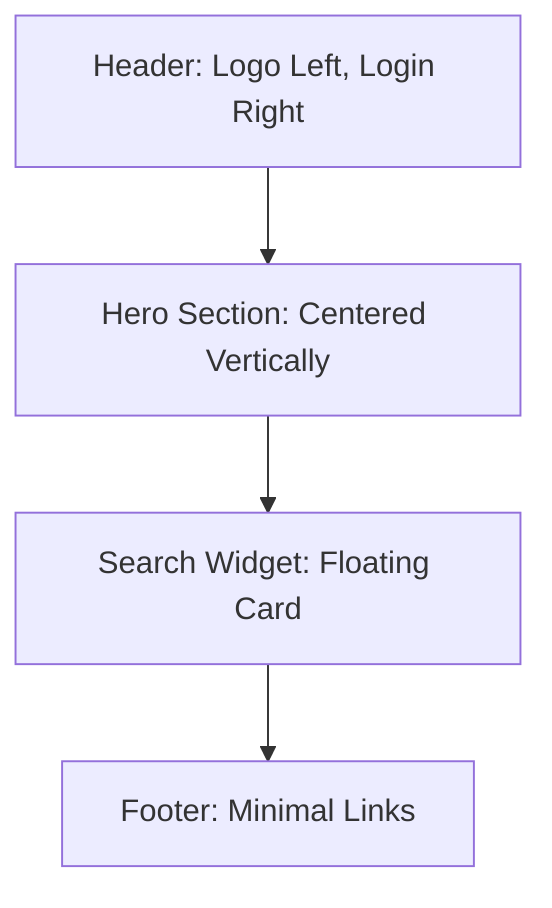
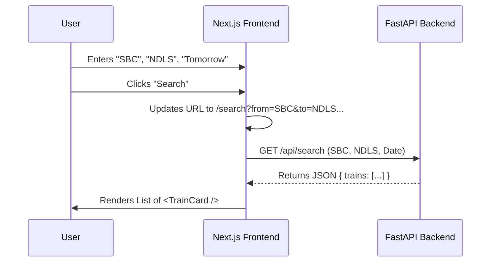

# UI Wireframes: Treno Web

Since Antigravity builds code directly, we use **"Code-First Wireframes"** (Specifications) instead of images. This document tells the Agent exactly what to build using Next.js and Tailwind.

## 1. Design Philosophy
*   **Visual Identity:** "Apple-esque Minimalist". Clean, high whitespace, focus on typography.
*   **Typeface:** Inter (San Francisco style).
*   **Palette:**
    *   **Backgrounds:** `bg-slate-50` (App), `bg-white` (Cards).
    *   **Primary Action:** `bg-indigo-600` (Buttons).
    *   **Status:** `text-emerald-600` (Available), `text-rose-600` (Waitlist/Delayed).
    *   **Text:** `text-slate-900` (Headings), `text-slate-500` (Metadata).
*   **Interaction:** Instant feedback. No page reloads (Client-side navigation).

---

## 2. Page Layouts

### 2.1 Home Page (`/`)
**Goal:** Zero-distraction entry point. Get the user to search immediately.

**Layout Structure:**


**Component Spec (`<HeroSection />`):**
*   **Container:** `flex flex-col items-center justify-center min-h-[80vh]`
*   **Data Freshness Banner:** `<DataFreshnessBanner />` (See Section 3.2)
*   **Title:** "Travel India, Simply." (`text-5xl font-bold tracking-tight text-slate-900`)
*   **Subtitle:** "Zero ads. Zero lag. Just trains." (`mt-4 text-xl text-slate-500`)
*   **Widget:** `<SearchWidget mode="hero" />` (See below).

---

### 2.2 Search Results Page (`/search`)
**Goal:** High data density but scannable.

**Layout Structure:**
*   **Header:** Sticky. Contains a *compact* version of `<SearchWidget />` to modify dates/stations instantly.
*   **Sidebar (Desktop):** Filters (Quota, Class, Departure Time). Hidden on Mobile (Slide-over).
*   **Main Feed:** Infinite scroll list of Train Cards.

**Component Spec (`<TrainCard />`):**
*   **Wrapper:** `group relative flex flex-col gap-4 rounded-2xl border border-slate-200 bg-white p-6 shadow-sm hover:shadow-md transition-all`
*   **Header Row:**
    *   Left: Train Name & Number (e.g., "12627 • KARNATAKA EXP") - `font-semibold`
    *   Right: Days Running (e.g., "M T W T F S S") - Active days bolded.
*   **Timeline Row (The Visual Core):**
    *   **Departure:** `19:20` (`text-2xl font-bold`) -> Station Code (`SBC`)
    *   **Duration Bar:** `------- 13h 40m -------` (Dotted line with duration centered)
    *   **Arrival:** `09:00` (`text-2xl font-bold`) -> Station Code (`NDLS`)
*   **Footer Row:**
    *   "View Route" (Ghost Button)
    *   "Check Availability" (Primary Button)

---

## 3. Core Components

### 3.1 `<SearchWidget />`
The most complex component. It must be a "Client Component" (`use client`).

*   **Inputs:**
    1.  **From Station:** Combobox (Headless UI). Fetches from `api/stations`.
        *   *Behavior:* Type "Ban", shows "Bangalore (SBC)", "Bangarapet (BWT)".
    2.  **To Station:** Combobox.
    3.  **Date:** Native Date Picker (or Radix UI Popover Calendar). Default: `Today`.
*   **Action:** "Search Trains" Button (`w-full py-3 rounded-xl bg-indigo-600 text-white font-medium hover:bg-indigo-700`).
*   **Mobile Behavior:** Stacked vertically.
*   **Desktop Behavior:** Horizontal row.

### 3.2 `<DataFreshnessBanner />`
**Purpose:** Display prominent disclaimer about data staleness to set user expectations and provide legal protection.

**Placement:** Top of home page, above hero section.

**Component Spec:**
```jsx
// components/DataFreshnessBanner.tsx
export function DataFreshnessBanner() {
  return (
    <div className="w-full bg-amber-50 border-l-4 border-amber-400 p-4">
      <div className="max-w-4xl mx-auto flex items-start">
        <div className="flex-shrink-0">
          <svg className="h-5 w-5 text-amber-400" viewBox="0 0 20 20" fill="currentColor">
            <path fillRule="evenodd" d="M8.257 3.099c.765-1.36 2.722-1.36 3.486 0l5.58 9.92c.75 1.334-.213 2.98-1.742 2.98H4.42c-1.53 0-2.493-1.646-1.743-2.98l5.58-9.92zM11 13a1 1 0 11-2 0 1 1 0 012 0zm-1-8a1 1 0 00-1 1v3a1 1 0 002 0V6a1 1 0 00-1-1z" clipRule="evenodd" />
          </svg>
        </div>
        <div className="ml-3">
          <p className="text-sm text-amber-700">
            <strong>Portfolio Demo:</strong> Using 2024 baseline train schedule data. 
            <span className="font-semibold">Not for actual travel planning.</span> Data may be outdated or incomplete.
          </p>
        </div>
      </div>
    </div>
  );
}
```

**Styling:**
*   Background: `bg-amber-50` (subtle warning color)
*   Border: `border-l-4 border-amber-400` (left accent)
*   Text: `text-amber-700` (readable dark amber)
*   Icon: Warning triangle from Heroicons

**Trade-offs:**
*   **Pro:** Legal protection; honest about limitations; builds trust
*   **Con:** May reduce perceived credibility
*   **Mitigation:** Frame as "portfolio demo" to shift expectations from production app to learning project

### 3.3 `<Footer />`
**Purpose:** Provide legal disclaimers, data attribution, and navigation links.

**Placement:** Bottom of all pages.

**Component Spec:**
```jsx
// components/Footer.tsx
export function Footer() {
  return (
    <footer className="mt-16 border-t border-slate-200 bg-slate-50 py-12">
      <div className="max-w-4xl mx-auto px-4">
        {/* Data Attribution */}
        <div className="text-center mb-8">
          <p className="text-sm text-slate-600">
            📊 Data sourced from{' '}
            <a 
              href="https://www.kaggle.com/datasets/sripaadsrinivasan/indian-railways-dataset"
              target="_blank"
              rel="noopener noreferrer"
              className="underline hover:text-indigo-600 transition-colors"
            >
              Kaggle (2024 baseline)
            </a>
            . Not affiliated with Indian Railways or IRCTC.
          </p>
        </div>
        
        {/* Legal Disclaimer */}
        <div className="bg-amber-50 border border-amber-200 rounded-lg p-4 mb-8">
          <p className="text-sm text-amber-800 text-center">
            ⚠️ <strong>For demonstration purposes only.</strong> Do not use for actual travel planning. 
            Train schedules, availability, and timings may be inaccurate or outdated.
          </p>
        </div>
        
        {/* Footer Links */}
        <div className="flex flex-wrap justify-center gap-6 text-sm text-slate-500">
          <a href="/privacy" className="hover:text-indigo-600 transition-colors">
            Privacy Policy
          </a>
          <span className="text-slate-300">•</span>
          <a href="/terms" className="hover:text-indigo-600 transition-colors">
            Terms of Service
          </a>
          <span className="text-slate-300">•</span>
          <a href="https://github.com/rasivasu/treno-web" 
             target="_blank" 
             rel="noopener noreferrer"
             className="hover:text-indigo-600 transition-colors">
            GitHub
          </a>
        </div>
        
        {/* Copyright */}
        <div className="mt-8 text-center text-xs text-slate-400">
          <p>© 2026 Treno Web. A portfolio project by Ravisankar.</p>
          <p className="mt-1">Built with Next.js, FastAPI, and SQLite.</p>
        </div>
      </div>
    </footer>
  );
}
```

**Key Elements:**
1. **Data Attribution:** Links to Kaggle dataset with clear sourcing
2. **Legal Disclaimer:** Prominent warning box to prevent liability
3. **Footer Links:** Privacy Policy, Terms of Service, GitHub repo
4. **Copyright:** Personal branding for portfolio

**Styling Notes:**
*   Use `bg-slate-50` background to distinguish footer from main content
*   Warning box uses same `bg-amber-50` pattern as banner for consistency
*   All external links have `target="_blank"` and `rel="noopener noreferrer"` for security

---

## 4. User Flow
